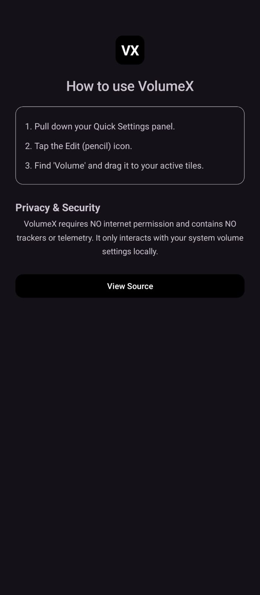
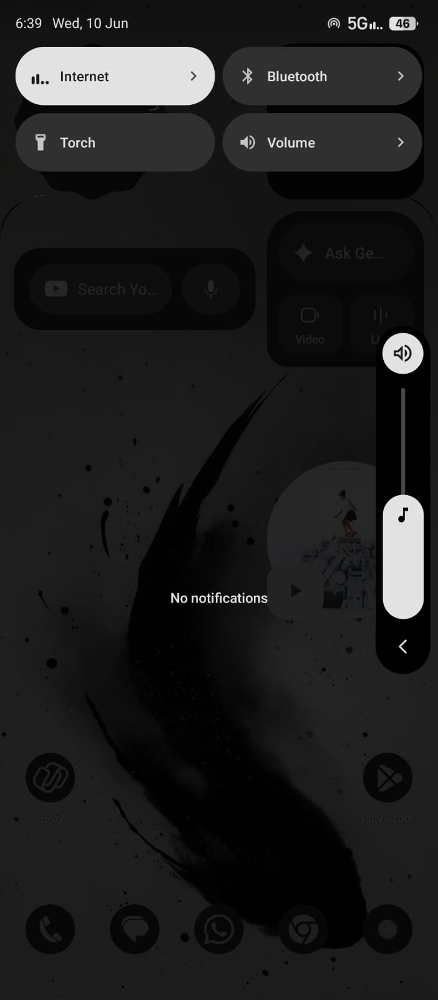

  <h1>VolumeX</h1>
  
Minimalist high-precision volume control for Android

  
    

  
  
  
  

---

VolumeX is a specialized system utility designed for seamless audio management. It provides a non-intrusive, high-performance volume shortcut directly within the Android Quick Settings environment, eliminating the need for physical button interaction.

## Features

- **System Integration:** Instant access via native Quick Settings tiles.
- **Hardware Preservation:** Reduces wear on physical volume rockers.
- **Resource Efficiency:** Zero background execution or battery consumption when idle.
- **Privacy Focus:** Operates entirely offline with no internet permissions or data collection.
- **Material 3 Design:** Follows modern Android design standards for a native feel.

<b>Interface Gallery</b>

 

  
  

## Technical Configuration

- **Minimum SDK:** 29 (Android 10).
- **Architecture:** 100% Kotlin/Java with native Android APIs.
- **Build System:** Gradle (Standard Android).

## Build Requirements

1. **Clone:** `git clone https://github.com/snap24/volumeX.git`
2. **Environment:** Android Studio Koala+, JDK 17.
3. **Execution:** Use `./gradlew assembleRelease` for production-ready binaries.

## Available On

## License

This project is licensed under the Apache License 2.0. See [LICENSE](LICENSE) for details.

---

  Maintained by Chinmai H B

